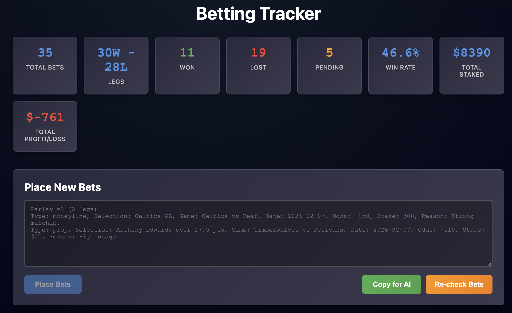
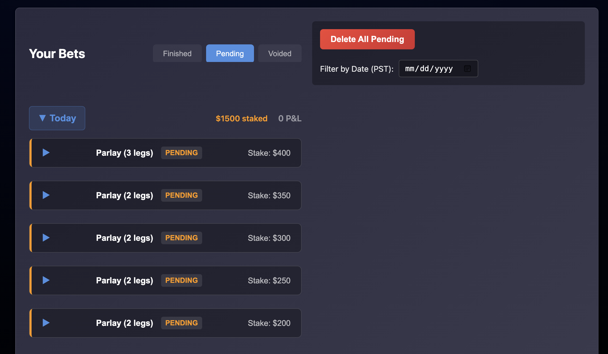
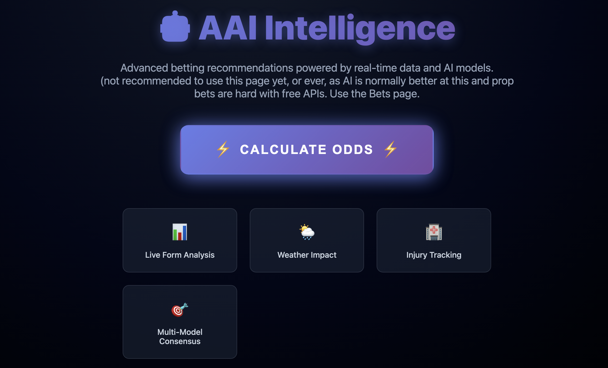
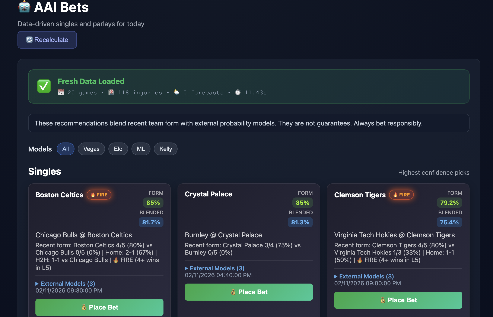
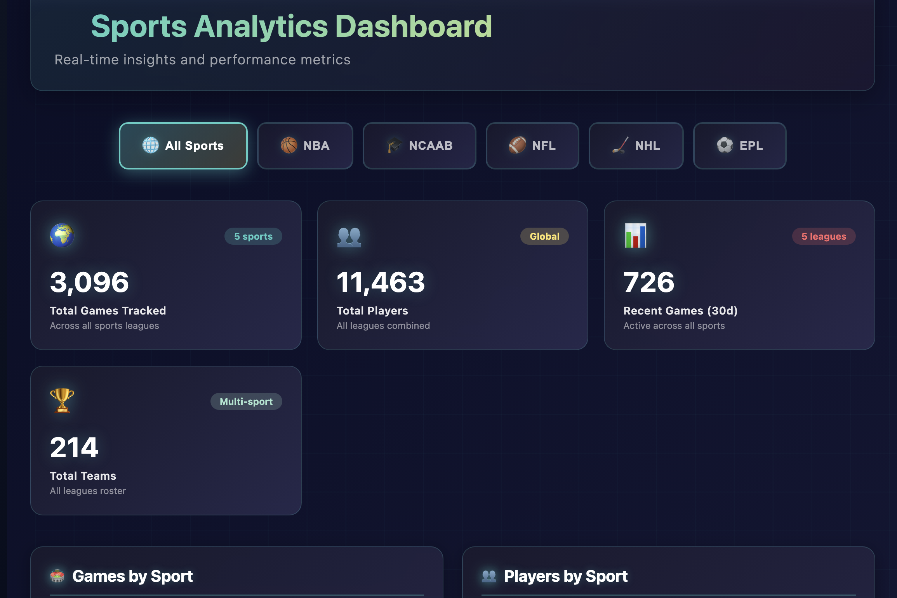
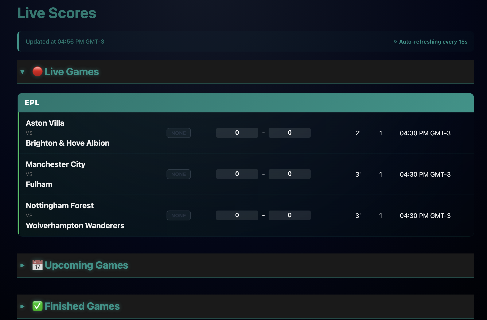
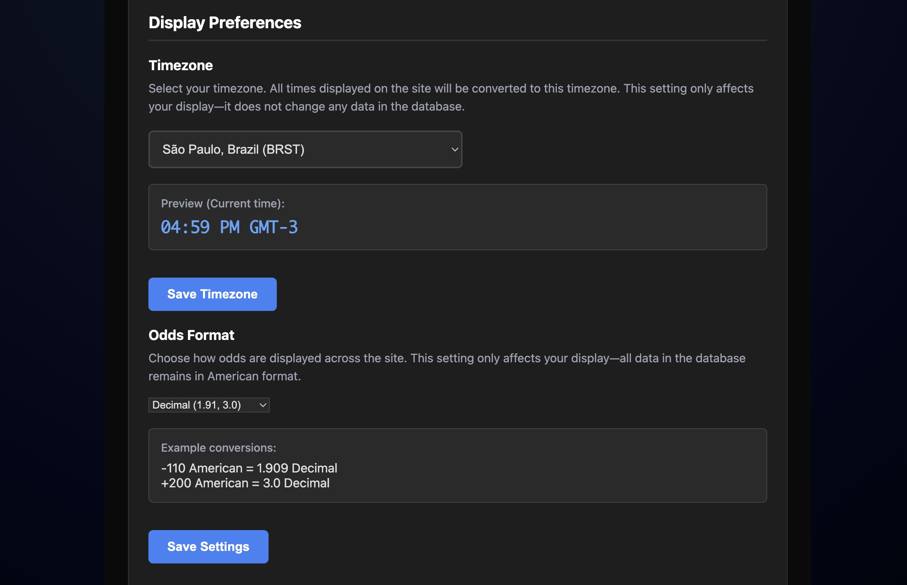
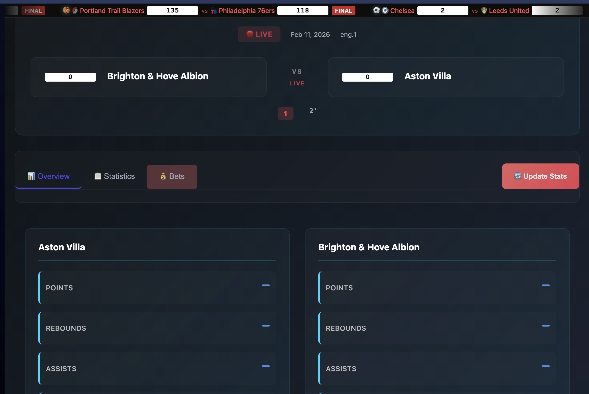
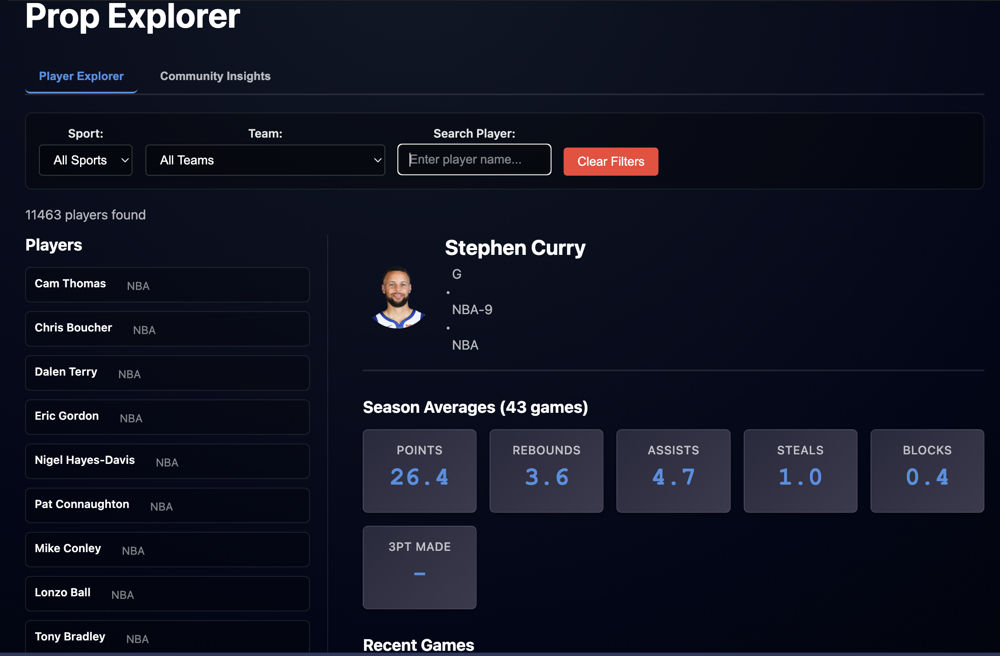

# Sports Betting Dashboard

A full-stack sports betting intelligence platform with AI-powered recommendations, real-time live scores, and advanced analytics.

## 🚀 Quick Start

### Prerequisites
- Python 3.10+
- Node.js 16+
- PostgreSQL 14+

### Installation

1. **Backend Setup**
```bash
cd backend
pip install -r requirements.txt
python -m uvicorn main:app --reload
```
Backend runs on `http://localhost:8000`

2. **Frontend Setup**
```bash
cd frontend
npm install
npm run dev
```
Frontend runs on `http://localhost:5173`

3. **Database**
```bash
# Create PostgreSQL database and set credentials in backend/config.py
alembic upgrade head
```

## 📚 Documentation

**Start here**: [DOCUMENTATION_INDEX.md](DOCUMENTATION_INDEX.md) - Guides you to the right docs for your need

### Key Guides
- **[PROJECT_STRUCTURE.md](PROJECT_STRUCTURE.md)** - Codebase organization and architecture
- **[BETTING_TRACKER_README.md](BETTING_TRACKER_README.md)** - How the AI betting system works
- **[TIMEZONE_QUICK_START.md](TIMEZONE_QUICK_START.md)** - Setting up timezone preferences
- **[COMMUNITY_INSIGHTS_QUICKSTART.md](COMMUNITY_INSIGHTS_QUICKSTART.md)** - What's trending in betting community
- **[LATEST_UPDATES.md](LATEST_UPDATES.md)** - Recent feature additions

## ✨ Features

### 🏟️ Community Insights
See what the betting community is picking:
- **Reddit** - Trending props from r/sportsbooks, r/nba, r/nfl
- **Discord** - Sharp bettors' picks from betting channels
- **Anonymized** - Aggregate statistics, no personal info
- **Real-time** - Updates as community discusses props

Find what's hot in 3 steps:
```bash
pip install -r backend/requirements.txt
python -m uvicorn main:app --reload
curl http://localhost:8000/insights/trending?time_filter=day
```

### 📊 Live Scores
Real-time game updates from ESPN with:
- Live score tracking
- Game status and timing
- Start time conversion to your timezone

### 🤖 AAI Betting (AI Recommendations & Custom Parlays)
Data-driven bet suggestions combining:
- **Form Analysis**: Recent team performance (5 games/90 days)
- **External Models**: Vegas odds, Elo ratings, ML predictions, Kelly criterion
- **Confidence Blending**: 50% form-based + 50% model-based


Features:
- Model selection toggles (Vegas, Elo, ML, Kelly, All)
- Multiple parlay sizes: 2, 3, 4, 5, 7, 12-leg
- Expanded model breakdown with individual probabilities
- **Custom Parlay Builder**: Default pick is always 'TeamName ML' for moneyline bets, and default reason is 'AAI Custom Bet'. All custom parlays send a valid pick field matching backend expectations.

### 💰 Bet Tracking
- Log bets with rich details
- Auto-grade completed bets
- Track P&L and ROI
- Filter by date, status, sport

### 📈 Analytics
- Betting performance metrics
- Win rate by sport
- ROI analysis
- Shareable reports

### ⚙️ Settings
- **Timezone Conversion**: All times convert to your selected timezone (44 options)
- Frontend-only, zero database impact

## 🏗️ Architecture

```
User Interface (React)
        ↓
API Layer (FastAPI)
        ↓
Business Logic (Services)
        ↓
Data Layer (Repositories)
      ↓
   Database (PostgreSQL)
```

### Key Components
- **Scheduler**: Background task runner (ESPN scraping, live updates, bet grading)
- **Intelligence Services**: Game analysis, player props, recommendations
- **External Models**: Probability aggregation from multiple sources
- **Alert System**: Notifications for games and bet outcomes

## 🔧 Development

### File Organization

**Backend** (`backend/`)
- `main.py` - FastAPI app & scheduler
- `routers/` - HTTP endpoints
- `services/` - Business logic
- `models/` - Database schema
- `scheduler/` - Background tasks

**Frontend** (`frontend/`)
- `src/pages/` - Page components
- `src/services/` - API & utilities
- `src/components/` - Reusable UI

See [PROJECT_STRUCTURE.md](PROJECT_STRUCTURE.md) for detailed layout.

### Common Tasks

**Add a timezone**
```javascript
// frontend/src/services/timezoneService.js
// Edit getAvailableTimezones() function
```

**Change parlay sizes**
```python
# backend/services/aai/recommendations.py
# Edit parlay_sizes parameter in generate()
```

**Add external model**
```python
# backend/services/aai/recommendations.py
# Implement in ExternalOddsAggregator class
```

## 📊 Data Flow

```
ESPN API
   ↓
Scheduler (every 5 min)
   ↓
games_live (real-time)
games_upcoming (scheduled)
games_results (completed)
   ↓
Services (intelligence, AAI, betting)
   ↓
API Endpoints
   ↓
React Frontend
   ↓
Timezone Conversion (browser)
   ↓
User
```

## 🧹 Maintenance

### Clean up workspace
```bash
bash cleanup.sh
```
Removes cache, test files, and temporary data.

### Database maintenance
```bash
# Backup (PostgreSQL)
pg_dump <your_db_name> > backup.sql

# Reset
dropdb <your_db_name>
createdb <your_db_name>
alembic upgrade head
```

## 🔐 Security

- ✅ CORS enabled for local development
- ✅ No sensitive keys in code
- ✅ Database migrations tracked
- ✅ Input validation on all endpoints

## 📦 Dependencies

**Python** (backend/requirements.txt)
- FastAPI
- SQLAlchemy (async, PostgreSQL)
- asyncpg (PostgreSQL driver)
- aiohttp (API requests)
- Pydantic (validation)

**JavaScript** (frontend/package.json)
- React 18+
- React Router
- Axios (HTTP client)
- Vite (build tool)
- Custom Parlay Builder (see Features)

## 🤝 Contributing

1. Create a feature branch
2. Make changes following the project structure
3. Test locally (backend + frontend)
4. Run `cleanup.sh` before committing
5. Update docs if changing functionality

## 📝 License

MIT

## 🆘 Troubleshooting

**Backend won't start**
- Check Python 3.10+: `python --version`
- Install deps: `pip install -r backend/requirements.txt`
- Database issue: `alembic upgrade head`

**Frontend won't load**
- Check Node 16+: `node --version`
- Clear cache: `rm -rf frontend/node_modules && npm install`
- Vite issue: `npm run dev --force`

**No data showing**
- Check scheduler running (backend logs)
- ESPN API accessible (test in browser)
- Database has records: `sqlite3 sports_intel.db ".tables"`

## 📞 Support

Check the documentation guides in [DOCUMENTATION_INDEX.md](DOCUMENTATION_INDEX.md) for detailed help on specific features.

## Screengrabs










---

**Last Updated**: February 2026  
**Status**: For individual use only. This is the only README—see here for all project instructions. Bet responsibly; this git can't be blamed for any losses you accrue.
